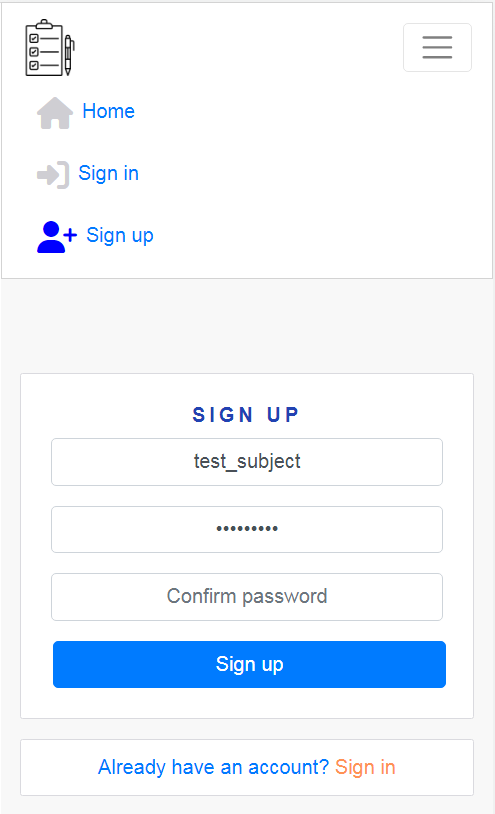
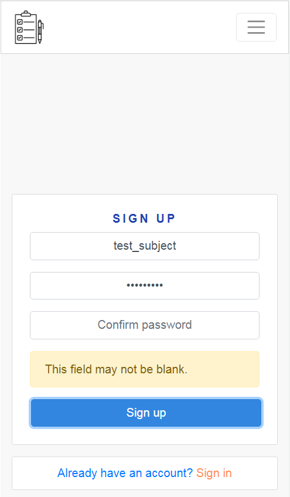
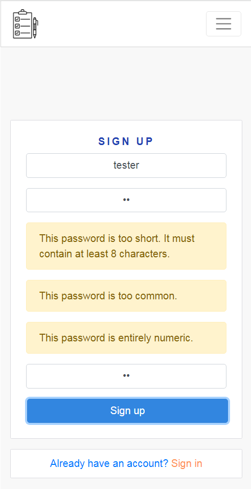
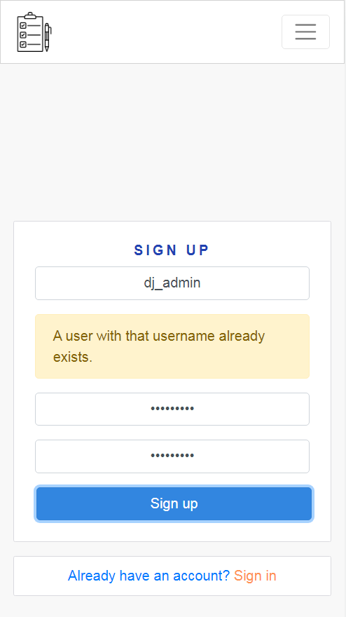
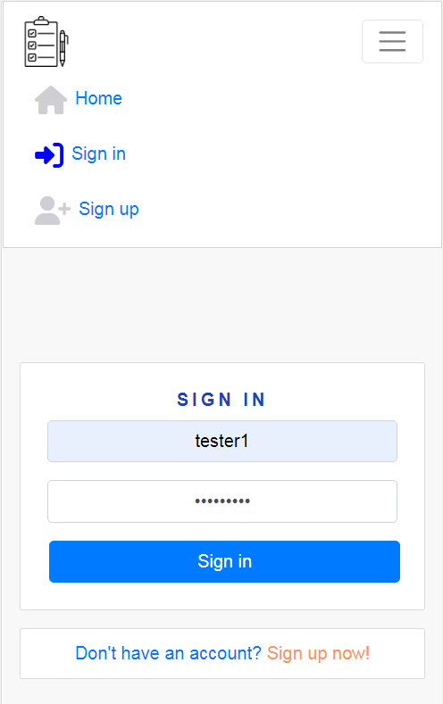
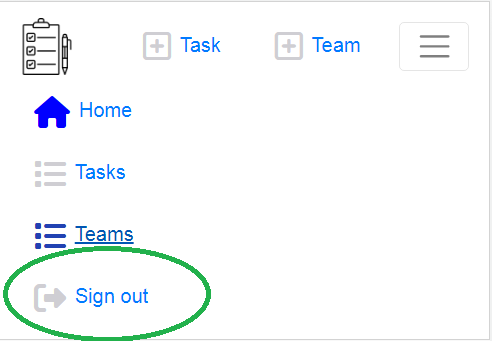
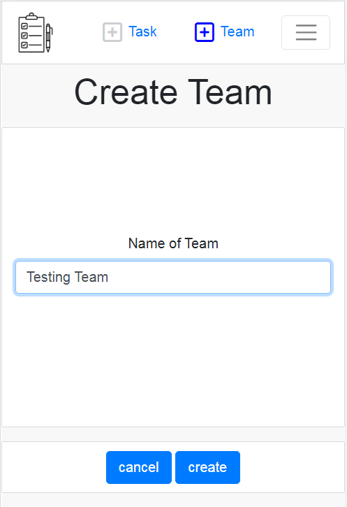
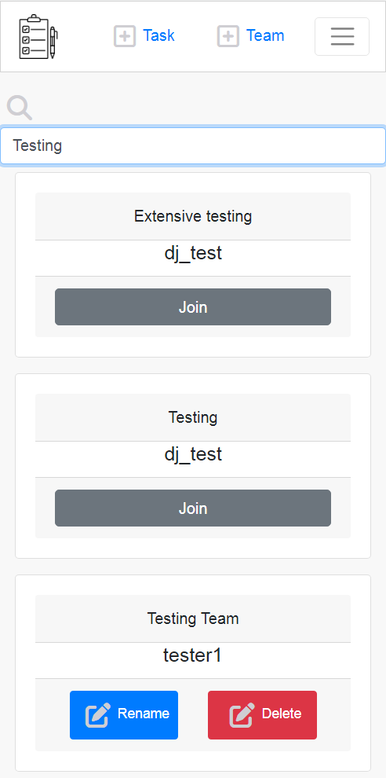
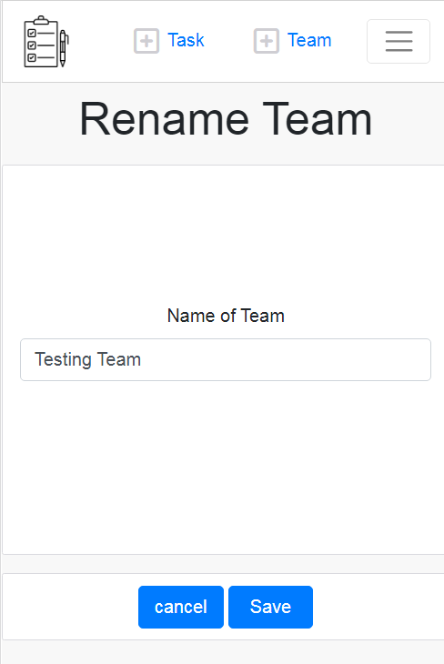

# Organizer 
Organizer helps users to organize their tasks, such as chores, errands and work-related matters.
It allows users to form teams and assign tasks to their teammates.

## UER SOTRIES
---
### Registration

If the registration was successful, then the user is forwarded to the login page.
---
#### Validation
If one of the password fields is left empty

If the password is not valid

If the username is already exists

---
### Login

---
### Logout
Click or tap on Sign out in the navigation menu

---
### Create Team

If the team was created successfully the user will be forwarded to the page with the list of teams.

---
### Rename Team
Updating the team is just a renaming function. It allows users to rename their teams. 
To rename the team click on **Teams** in the navigation menu. Once the List of teams
appears on screen. Go to the search bar and type in the first sequence of letters in
the name of the team, so it can be found more quickly. 

As soon as you can see the team,
you will also see that their is a button that reads **Rename**. Tap on that button and a
window will open that allows you to rename it. When done, click on **Save**.

---
### Delete Team
To delete the team click on **Teams** in the navigation menu. Once the List of teams
appears on screen. Go to the search bar and type in the first sequence of letters in
the name of the team, so it can be found more quickly. 

Now simply click on the delete button on the team.

---
### View List of Teams
To see a list of teams click on **Teams** in the navigation menu. Once the List of teams
appears on screen. Go to the search bar and type in the first sequence of letters in
the name of the team or the username whose teams you want to be listed, so it can be found more quickly. 

---
### Joining or Leaving Teams

---
#### Search Teams

---
### Create Task
assign task to teammates

---
#### Validation

---
### Update Task

---
#### Validation

---
### Delete Task

---
### View List of Tasks

Search field
Filters

---
## Testing
---

### Test Registration

---
### Test Login

---
### Test Logout

---
### Test Creating Teams
Validation

---
### Test Updating Teams
Validation

---
### Test Deleting Teams

---
### Test Listing Teams

---
#### Test Searching Teams
- Filters

---
### Test Joining Teams

---
### Test Leaving Teams

---
### Test Creating Tasks
- assign task to teammates
- Validation
---
### Test Updating Tasks
- Validation

---
### Test Deleting Tasks

---
### Test Listing Tasks

Search field
Filters

---

### Deployment on heroku
The repository already contains the Procfile, that is the only thing that heroku will need to build the application.
All that is necessary to do is go to the dashboard and create a new app, that uses a github repository. Specify this 
repository and go to Deploy tab. Then click on **Deploy branch**. 

## BUGS
## Signin Form
Validation fields are not showing the response from API