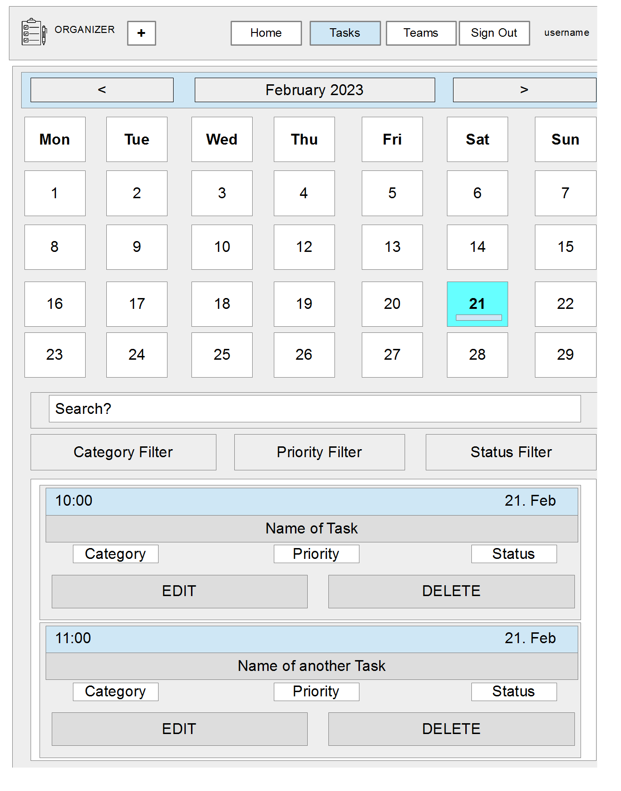
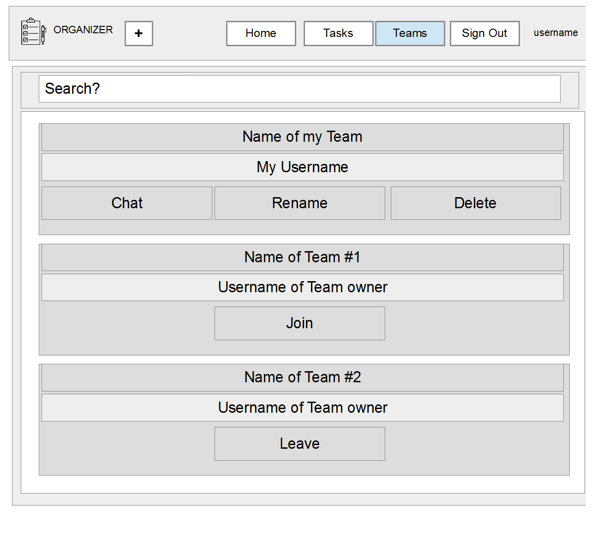
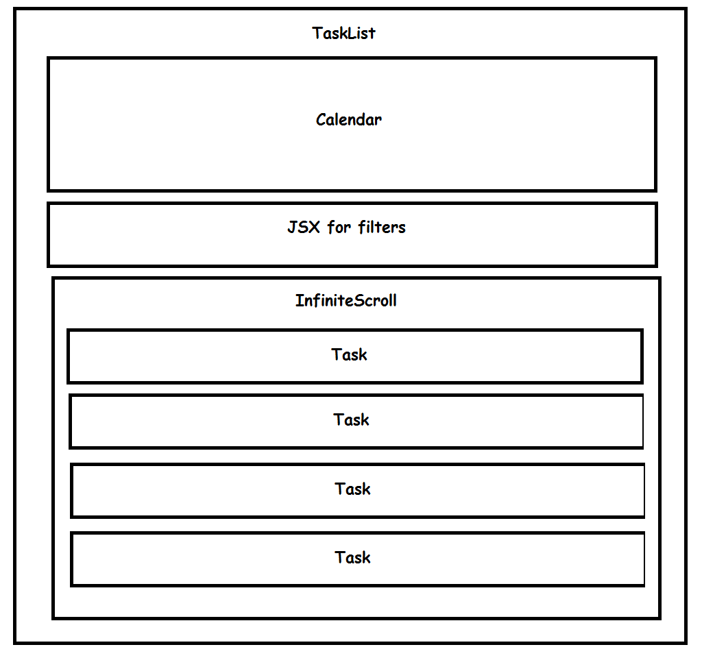
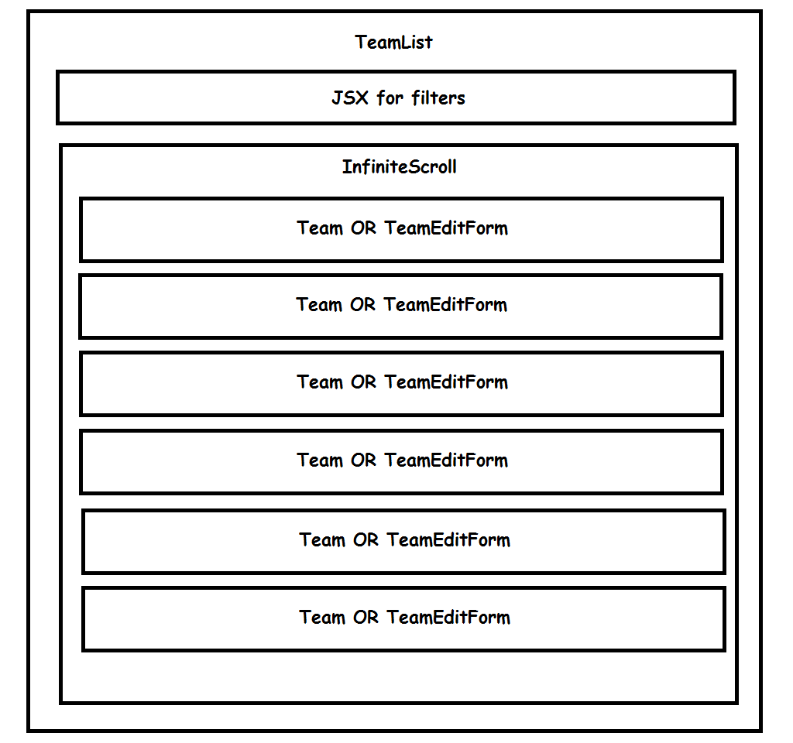
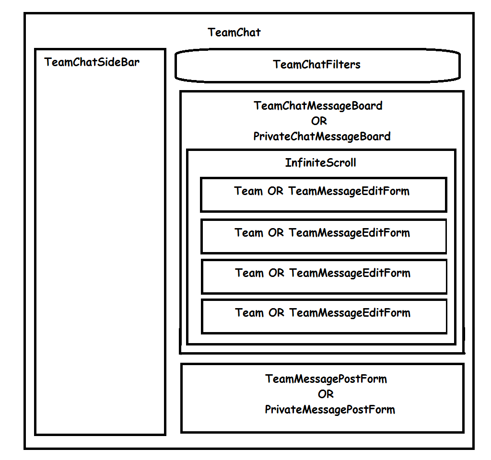

# Organizer 
Organizer helps users to organize their tasks, such as chores, errands and work-related matters.
It allows users to form teams and assign tasks to their teammates.

## Backend repository
[Open Backend Repository](https://github.com/dimitri-edel/organizer-api)

---
# User Stories

## Registration
An unregistered user can register with the website, so they can use the services provided by the application.

## Login
A registered user can sign in and use the application.

## List Tasks of any given day
An authenticated user can list tasks for any day in the calendar, so they can view what needs to be done on that day.

## List Tasks of an entire month
An authenticated user can list tasks for an entire month, so they can get an overview of the work load of the month.

## Create Tasks
An authenticated user can create new tasks. 
A task must have the following attributes:
- selectable date and time
- selectable category (chore, errand, work)
- selectable priority (high, middle, low)
- selectable status (open, progressing, done)
- possibility to attach an image file
- possibility to assign the task to a teammate

## Filter Tasks
An authenticated user can filter tasks by title, date, category, priority and status, so they can sort them out in an efficient way.

## Edit Tasks
Owners of tasks can edit their tasks, so they can make changes if necessary.

## List Teams
An authenticated user can see the list of teams, so they can find and join any team.

## Create Teams
An authenticated user can create his or her own team, so other members can join them. Own teams allow the user to assign tasks to other team members, so they can delegate task as a team leader.

## Rename Teams
Owners of teams (team leaders) can delegate tasks to other members of their teams, so they can divvy up the work among the team.

## Join Teams
An authenticated user can join teams, so they can collaborate with other people a project. 

## Leave Teams
A member of a team can leave a team, so no more tasks of the team in question can be assigned to them anymore.

## Team Chat
Members of a team can engage in a team chat, so they can exchange information. An image file can be attached to a message.

## Private Chat
Members of a team can exchange private messages, if they can discuss issues that only concern the two of them. An image file can be attached to a message.

## Editable Messages
Owners of messages can edit their messages, so they can change them retrospectively.

## Deletable Messages
Owners of messages can delete their messages, if they become irrelevant or contain false information.

## Wireframes

### Page for displaying tasks

---
### Page for displaying teams

---

## Libraries 
- **react-bootstrap** is was used, because it offers a quick way to create responsive layout and styling of the components
- **react-bootstrap-datetimepicker** was used because I used bootstrap in this project and I needed a date-picker. However, any other date-picker would have done it.
- **react-infinite-scroll-component** is used for messages in team chat or listing tasks or teams. It offers a quick solution for loading the content dynamically, into a scroll panel. If the user starts scrolling down, then more content is loaded. To load the next chunk of data into the scroll panel, this element uses the **fetchMoreData** function which is defined in **utils.utils.js**. The function calls the next page URL, that is part of data stored in a state variable. **fetchMoreData** can be used for any paginated data.
- **react-toastify** is used to deliver notifications to the user. It is very easy to use and has many features right out of the box.
- **axios** is an easy to use library for processing HTML-requests and HTML-responses.

## Patterns

### Calendar
The name of the component is **Calendar** in components.Calendar.js. It renders a calendar on the tasks page (TaskList.js). It sole purpose is to let the user pick a date or month, for which a list of tasks will be displayed in the list below. It only takes one state hook **setQuery** as a property.when the user clicks on a particular day or clicks on one of the month buttons(previous month, current month, next month), this hook function is executed and the selected query is passed to the parent component **TaskList**. It also renders an abbriviated list of tasks in each box with the day number.

The styling classes are defined in styles.Calendar.module.css.

The Calendar is organized in ControlPanel with three buttons (previous month, current month, next month) and a grid with day numbers. The grid with day numbers is organized in rows and cells. The three dimensional array named **calendar_cells** holds the day numbers and a list of tasks for the respective day - **calenndar_cells[row][column][attachments]**. 
It was the first and only react class component I ever wrote. Which made me appreciate the function components all the more The best solution would be to write it over as a function component. It works fine, but I consider it the problem child. The code looks convoluted and inflexible.  I chose to write my own calendar, because I did not like **react-calendar** and I was eager to find out if I could write one of my own. However, I was just beginning to learn about react at the time I wrote it.

### Tasks (Listing)
The name of the component is **TaskList** in pages.task.TaskList.js. It harbors the main Component for displaying the task management interface. It is rendered in the **App** component and is mapped to the **route /tasks/**.

#### Diagram of Tasks Page Components

This diagram depicts how the components are organized inside a task list page.

---

### Create Task
The name of the component is **CreateTaskForm** in pages.task.CreateTaskForm.js. This component is for creating new tasks. It is rendered in the **App** component and is mapped to the **route /tasks/create**.

### Edit Task
The name of the component is **EditTaskForm** in pages.task.EditTaskForm.js. This component is for editing existing tasks. It is rendered in the **App** component and is mapped to the **route /tasks/:id/edit**.

### Teams
The name of the component is **TeamList** in pages.team.TeamList.js. It harbors the main Component for displaying the team management interface. It is rendered in the **App** component and is mapped to the **route /teams/**.

#### Team List Page Components

This diagram shows how the components on the team list page are organized. The **OR** means that the components are rendered conditionally. If the user clicked on rename on one of the teams then the TeamEditForm will be rendered instead of the Team component.

---

### Create Team
The name of the component is **CreateTeamForm** in pages.team.CreateTeamForm.js. This component is for creating new teams. It is rendered in the **App** component and is mapped to the **route /teams/create**.

### Team
The name of the component is **Team** in pages.team.Team.js. It shows the name of a particular team in the list of teams. It provides a set of control elements such as **rename, delete, join, leave**. This component is embedded in the JSX of **TeamList**. It is wrapped inside a map function of the dictionary with the data from the API. The map function is called by **bootstrap's InfiniteScroll** component.

### Rename Team
The name of the component is **TeamEditForm** in pages.team.TeamEditForm.js. This component is embedded in the JSX of **TeamList**. It will be rendered in place of the respective **Team** component in the list if **EditTeamId** state variable is not null. The state variable **EditTeamId** is declared in the parent component **TeamList**.

### StaticContext in context.StaticContext.js
For educational purposes I created a Component, namely Calendar, as a class Component. The drawback is that one cannot use context hooks in a class component. I decided to use a static context for making the selected date in the calendar globally available. When user selects a day in the calendar and then clicks on the **add Task** menu item in the navigation bar, then the date will be stored in StaticContext.SELECTED_DATE. When the form for creating new tasks is rendered the selected date is used as the initial value for the due date of a task. 

### Team Chat

The name of the component is **TeamChat** in pages.team.TeamChat.js. It harbors the main Component for displaying a chat room. It is rendered in the **App** component and is mapped to the **route /team-chat/:team_id/**.
This component renders three child-components: TeamChatFilters, TeamMessageBoard and TeamMessagePostForm.
It uses a constant team_id, which is a parameter in the URL route and signifies the private key of the team.
It uses a state variable named **reload**, which is a boolean flag that signals whether or not the content of the message board must be reloaded. If set to true, the message board will reload the list of messages on the board. The reason for this flag being declared in the parent component is so components other than the message board can trigger a reload of the messages. It is basically an event pattern.

#### Diagram of Team Chat Page Components

The names in the picture are the names of components used to render a chat room.
The **OR** means that either one component is rendered or the other. The rendering is conditional.

---
#### Side Bar
The Name of the component is **TeamChatSideBar** in pages.team.TeamChatSideBar.js. The purpose of this component is to show all members of a particular team. Clicking on a username in the sidebar will open a private chat with that user.

#### Filters
The Name of the component is **TeamChatFilters** in pages.team.TeamChatFilters.js. The purpose of this component is to search the messages by username or keywords in a message. It also allows to filter the messages by how long ago they were posted. Current possibilities are (All, Since yesterday, 1 Week, 2 Weeks, 3 Weeks).  More filters can be easily added by changing the **value** of an **option** to the number of days that the messages should go back.

#### Team Message Board
The Name of the component is TeamMessageBoard in pages.team.TeamMessageBoard.js. It renders a list of messages within a team.
To load the messages a **request** to the **API** is issued and the data gets extracted from the response.I used the **useEffect** hook with a closure (nested function) named **fetchMessages**.
Each **Message** is a component of type **TeamMessage**. 
If a message has been picked for **editing**, then a **TeamMessageEditForm** will be rendered instead of the message itself. This allows the user to update the message.
State variable **messages** holds the data fetched from the API.
State variable **hasLoaded** is a boolean flag that is set to true by **fetchMessages** as soon as the data is loaded from the Response.
State variable **editMessageId** holds the private key of a message if the user clicks on the edit button on that message. If no message is being edited then the flag must be set to false. Since the edit button is part of the **TeamMessage** component, the **setEditMessageId** setter function is passed down to that component.
The **checkForMessages** function is triggered at three second intervals to make sure that new messages from other team members are displayed as soon as they post them. The **intervals** are set inside the **useEffect** hook.

#### Team Message Post Form
The name of the component is **TeamMessagePostForm** in pages.team.TeamMessagePostForm.js. It provides an interface for posting new messages. The post request is sent to the API URL **"team-chat-post/?team_id?**. It attaches a form to the request. The request is handled inside the **handleSubmit** function.

#### Private Message Board
---
**NOTE** that for the time being, both users who wish to exchange private messages must have picked the respective user in the side-bar to engage in a private chat. In order to prompt a user to a private session, an additional model must be implemented in the backend. That model would represent an event and the TeamChat component can check for that event asynchronously, just like I did with the message counter. This could be done in the next iteration.
---

PrivateMessageBoard is a function that renders a list of messages within a team.
To load the messages a **request** to the **API** is issued and the data gets extracted from the response.I used the **useEffect** hook with a closure (nested function) named **fetchMessages**.
Each **Message** is a component of type **PrivateMessage**. 
If a message has been picked for **editing**, then a **PrivateMessageEditForm** will be rendered instead of the message itself. This allows the user to update the message.
State variable **messages** holds the data fetched from the API.
State variable **hasLoaded** is a boolean flag that is set to true by **fetchMessages** as soon as the data is loaded from the Response.
State variable **editMessageId** holds the private key of a message if the user clicks on the edit button on that message. If no message is being edited then the flag must be set to false. Since the edit button is part of the **PrivateMessage** component, the **setEditMessageId** setter function is passed down to that component.
The **checkForMessages** function is triggered at three second intervals to make sure that new messages are displayed as soon as they are posted by the other team member. The **intervals** are set inside the **useEffect** hook.

#### Private Message Post Form
The name of the component is **PrivateMessagePostForm** in pages.team.PrivateMessagePostForm.js. It provides an interface for posting new messages. The post request is sent to the API URL **"private-chat-post/?team_id?**. It attaches a form to the request. The request is handled inside the **handleSubmit** function.

#### User notifications
The name of the component is **ToastContainer**, which is provided by the library **react-toastify**. It is embedded in index.js right next to the **App** container. The messages can be displayed at any point by using the **toast** function from the library, that needs to be imported into the js file that intends to use it. The function takes a set of parameters such as the message itself. The list of parameters also includes many other features that control the look and behavior of the component. This page provides a great way to do this [react-toastify-page](https://fkhadra.github.io/react-toastify/introduction). One can choose all the options on the page and will see what it is going to look like and will also see a code snippet of the function call that corresponds to all the settings that one provided. Just copy, paste, change the message and Bob's your uncle.

## Converting Dates
The API is set to return date-time fields in the following format: 24 Aug 2023 21:14
The React DOM components expect a string that looks like this : 2023-08-24 21:14
I have written a function that converts the former to the ladder so it can be used to initialize the Date-Pickers.
The function's name is **convertDateFormat**. It expects a string representation of the date-time, as it comes from the API, as a parameter. And it returns the string representation of the date-time as React's Date-Picker expects it. The function is defined in utils.js, which is located in the **utils** folder.

The same file **utils.js** contains another function that converts a Java-Script Date object into the string representation as it is expected by the Date-Picker. The name of this function is **convertDateToReactString** and it expects a Date object as a parameter. 

## Communication with the API
The application uses the **axios** library to communicate with the Backend. 
The default settings for the application are declared in **api/axiosDefaults.js**.

Here is what the content of the file looks like:

<code>
axios.defaults.baseURL = "https://organizer-api-f1f640e8d82c.herokuapp.com/";
axios.defaults.headers.post['Content-Type'] = "multipart/form-data";
axios.defaults.withCredentials= true;

export const axiosReq = axios.create();
export const axiosRes = axios.create();
</code>

The baseURL is the URL at which the API has been deployed
The Content-Type in the headers of the POST-Requests will be set to form-data
And the credentials will be used for the connection.

The last two lines instantiate two instances of axios, one for sending requests and one for receiving responses. They must be imported in every file that intends to use them. This approach allows us to separate response and request management, making it easier to read. 

## Updating user tokens
axios interceptors

# Manual Tests
## Registration
**TEST** | **ACTION** | **EXPECTATION** | **RESULT** 
----------|----------|----------|----------
**Sign Up** Link | User clicks on the **Sign Up** link in the **Navigation Bar** | The registration page opens | **SUCCESS** |
**Validation messages** | User leaves a field blank | A message is rendered next to the field that notifies the user that the field is required | **SUCCESS** |
**Username already exists** | User enters a name that already exists | A message appears **A user with that username already exists.** | **SUCCESS** |
**Password validation** | User enters a password that is either too short or too simple | Up too several messages appear underneath the password field that inform the user about the problem with the chosen password | **SUCCESS** |
**Successful registration** | User clicks on **Sign up** upon entering valid information | A notification message appears about the successful registration and the user is redirected to the sign-in page | **SUCCESS** |
---
## Login
**TEST** | **ACTION** | **EXPECTATION** | **RESULT** 
----------|----------|----------|----------
**Sign In** Link | User clicks on the **Sign In** Link in the **Navigation Bar** | The Login page opens | **SUCCESS** |
**Validation messages** | User leaves a field blank | A message is rendered next to the field that notifies the user that the field is required | **SUCCESS** |
**Password validation** | User enters the wrong password | A message informs the user that no user with the provided credentials exists | **SUCCESS** |
**Successful Sign In** | User entered valid credentials and clicked on the **Sign In** button | User is redirected to the home page and a welcome message is displayed. Username appears in the right corner of the navigation bar and previous navigation buttons are replaced with navigation links for authenticated users | **SUCCESS** |

## Logout
**TEST** | **ACTION** | **EXPECTATION** | **RESULT** 
----------|----------|----------|----------
**Logout** | User clicks on the **Sign Out** link in the **Navigation Bar** | The navigation buttons are replaced with **home, signin and signup** buttons and a message is displayed that informs the user about the logout | **SUCCESS** |

## List Tasks Tests
### Calendar as a Filter
**TEST** | **ACTION** | **EXPECTATION** | **RESULT** 
----------|----------|----------|----------
**Preselect current date** | User clicks on the **Tasks** link in the **navigation bar** | When the page is loaded the **current date** is **selected** in the **calendar** and the **tasks** for the current date are **listed** bellow. A button with a **plus** sign, for adding **new tasks** appears in the **Navigationo Bar** |  **SUCCESS** |
**Select entire month** | User clicks on the **middle button on the control panel of the calendar** with the name of the month and year. | The query is set to include all the tasks for the given month. The tasks for the selected month appear below. | **SUCCESS** |
**Select next month** | Usr clicks on the **next month button on the control panel of the calendar**. | The calendar shows the next month and the query is set to include tasks for the selected month. Tasks for the selected month appear below | **SUCCESS** |
**Select previous month** | User clicks on the **previous month button on the control panel of the calendar**. The calendar shows the next month and the query is set to include tasks for the selected month. Tasks for the selected month appear below | **SUCCESS** |
**Select a day** | User clicks on one of the days in the calendar | The day is marked as selected, the query is set to include tasks for the selected day. Tasks for the selected day appear below | **SUCCESS** |

### Searchbar as a filter
**TEST** | **ACTION** | **EXPECTATION** | **RESULT** 
----------|----------|----------|----------
**Search by title** | User enters a sequence of characers in the search bar | Tasks are filtered by title | **SUCCESS** |

### Filters (Category, Priority, Status)
**TEST** | **ACTION** | **EXPECTATION** | **RESULT** 
----------|----------|----------|----------
**Category** | User selects a category filter ('errand', 'chore', 'work') | Tasks that are in the selected category and selected month or date appear below | **SUCCESS** |
**Priority** | User slects a priority filter ('high', 'middle', 'low') | Tasks that are of the selected priorty and selected month or date appear below | **SUCCESS** |
**Status** | User slects a status filter ('open', 'progressing', 'done') | Tasks that are with the selected status and selected month or date appear below | **SUCCESS** | 
**Combining category and status filters** | User selects a category and a status as a filter, whereas priority remains set to all | Tasks are filtered accordingly and only those that correspond to the selected filters and month or day show up in the list below | **SUCCESS** |
**Combining priority and status filters** | User selects a priority and a status as a filter, whereas category remains set to all | Tasks are filtered accordingly and only those that correspond to the selected filters and month or day show up in the list below | **SUCCESS** |
**Combining priority and category filters** | User selects a priority and a category as a filter, whereas status remains set to all | Tasks are filtered accordingly and only those that correspond to the selected filters and month or day show up in the list below | **SUCCESS** |

## Create Tasks Tests
**TEST** | **ACTION** | **EXPECTATION** | **RESULT** 
----------|----------|----------|----------
**Open Page** | User clicks on the **Plus** icon (Add Tasks Link) in the **Navigation Bar**| The **page** for creating tasks **opens** and the **date** selected in the calendar is **preselected** in the form's date-picker | **SUCCESS** |
**Validation** | User leaves the **name** of the task **blank** and clicks on **create**.| A message appears underneath the name field that informs the user that the field may not be blank | **SUCCESS** |
**Attaching Image** | User clicks on the **link for uploading images** | A Window opens that allows the user to select an image | **SUCCESS** |
**Successful create** | Upon filling out the form user clicks on **create** | User gets redirected back to the taks page and a notification appears. The task appears in the list and the calendar. The data in the task reflects user's entries. | **SUCCESS** |

## List Teams Tests
**TEST** | **ACTION** | **EXPECTATION** | **RESULT** 
----------|----------|----------|----------

## Create Teams Tests
**TEST** | **ACTION** | **EXPECTATION** | **RESULT** 
----------|----------|----------|----------
## Rename Teams Tests
**TEST** | **ACTION** | **EXPECTATION** | **RESULT** 
----------|----------|----------|----------
## Join Teams Tests
**TEST** | **ACTION** | **EXPECTATION** | **RESULT** 
----------|----------|----------|----------
## Leave Teams Tests
**TEST** | **ACTION** | **EXPECTATION** | **RESULT** 
----------|----------|----------|----------
## Open Team Chat Tests
**TEST** | **ACTION** | **EXPECTATION** | **RESULT** 
----------|----------|----------|----------
## Post Message in Team Chat Tests
**TEST** | **ACTION** | **EXPECTATION** | **RESULT** 
----------|----------|----------|----------
## Edit Message in Team Chat Tests
**TEST** | **ACTION** | **EXPECTATION** | **RESULT** 
----------|----------|----------|----------
## Delete Message from Team Chat Tests
**TEST** | **ACTION** | **EXPECTATION** | **RESULT** 
----------|----------|----------|----------
## Open Private Chat Tests
**TEST** | **ACTION** | **EXPECTATION** | **RESULT** 
----------|----------|----------|----------
## Post Message in Private Chat Tests
**TEST** | **ACTION** | **EXPECTATION** | **RESULT** 
----------|----------|----------|----------
## Edit Message in Private Chat Tests
**TEST** | **ACTION** | **EXPECTATION** | **RESULT** 
----------|----------|----------|----------
## Delete Message from Private Chat Tests
**TEST** | **ACTION** | **EXPECTATION** | **RESULT** 
----------|----------|----------|----------

# BUGS
## Bug-Fix 1
**File pages/task/EditTaskForm.js** inside the **handleSubmit** function.
Before the form gets submitted, due_date is appended to an instance of FormaData. The date needs converting from the format that is used in the DatePicker to the format that is used by the API.
I created a function named **convertDatePickerDate** in utils/**utils.js**
## Bug-Fix 2
**utils/utils.js** inside **convertDateToReactString**. The month was off by one, because Date.getMonth() returns a month-index and not the month number. So the number had to be incremented by one to fit the bill.
## Bug-Fix 3
**components/calendar.js** calendar was not keeping its selected day, month, year when it was rerendering. I keep the settings in context/StaticContext. Becuase calendar is a class component, one cannot use state hooks or context hooks, so static variables seemed like the way to go.
## BUG: (unfixed) 
Upon creating or editing the tasks, the selected date in the calendar gets cleared. Even though I know how to fix it, but I only have a few hours left till submission, I am not sure if I will have the time to do it. However, this bug does not impact the overall functionality of the project. So, the user will probably select a different day anyhow. 

# Deployment on Heroku
